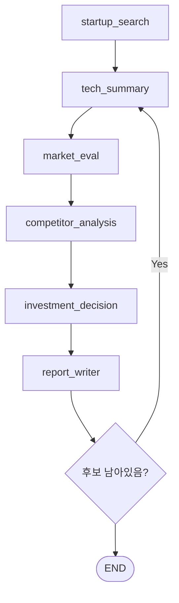

# AI 스타트업 투자 평가 에이전트

도메인: Robotics  
작성일: 2026-03-11  
방법론: LangGraph 기반 Multi-Agent + Agentic RAG

## 1. 목표

로보틱스 스타트업을 대상으로 기술력, 시장성, 경쟁 환경, 고객 ROI, 규제 리스크를 다각도로 분석하고 최종 투자 여부를 판단하는 멀티 에이전트 그래프를 설계한다.

이 프로젝트는 다음 두 가지를 동시에 만족하도록 설계한다.

- `LangGraph` 학습용 예제로서 상태 전이와 멀티 에이전트 협업 구조가 명확할 것
- 실제 투자 검토 프로세스처럼 `RAG + 스코어카드 + Hard Filter`가 결합될 것

## 2. 도메인 선정 근거

| 관점 | 내용 |
| --- | --- |
| 시장 성장성 | 글로벌 로봇 시장과 AI 로봇 시장이 높은 CAGR로 성장 중이며, 물류·제조·서비스 자동화 수요가 동시에 확대되고 있다. |
| AI 융합 가속 | AMR, Cobot, 휴머노이드 등에서 AI 기반 인지·계획·제어 통합이 빠르게 진행 중이다. |
| 투자 관심도 | 전략적 투자자와 정부 정책 자금이 동시에 유입되는 분야라 투자 평가 자동화 시나리오의 현실성이 높다. |
| 평가 복잡성 | HW, SW, 제조, 인증, 공급망, 현장 ROI를 함께 봐야 해서 단일 에이전트보다 멀티 에이전트 구조가 적합하다. |

예시 평가 대상:

- Figure AI
- Agility Robotics
- Rainbow Robotics
- Doosan Robotics
- Exotec

## 3. 멀티 에이전트 구성

| 에이전트 | 역할 | RAG | 핵심 입력 |
| --- | --- | --- | --- |
| `startup_search` | 후보 스타트업 발굴 및 기본 정보 정리 | O | 웹 검색 결과, IR/VC 요약 |
| `tech_summary` | 핵심 기술, 특허, TRL, 제조 가능성 분석 | O | 논문, 특허, 기술 문서 |
| `market_eval` | TAM/SAM/SOM, 구조적 수요, 성장성 분석 | O | 시장 보고서, 산업 뉴스 |
| `competitor_analysis` | 경쟁사 비교와 기술 해자 분석 | X | 웹 검색, 비교 템플릿 |
| `investment_decision` | 스코어카드 및 Hard Filter 기반 판단 | X | 구조화된 분석 결과 |
| `report_writer` | 투자 보고서 생성 | X | 모든 중간 산출물 |

문서 제한:

- 최대 4개 문서
- 문서당 50페이지 이하
- 총 200페이지 이하

## 4. RAG 설계

| 항목 | 선택 |
| --- | --- |
| 임베딩 모델 | `intfloat/multilingual-e5-large-instruct` |
| 벡터 저장소 | `FAISS` |
| 청크 크기 | 512 tokens 수준을 목표로 문자 기준 분할 |
| 사용 문서 | IR 자료, 특허/논문, 산업 리포트 |

선정 이유:

- 한국어/영어 혼합 검색이 가능하다.
- 오픈소스 기반이라 로컬 실습 비용이 낮다.
- 로보틱스 기업 문서는 다국어 혼합 비율이 높아 다국어 임베딩 이점이 있다.

## 5. 평가 프레임워크

세 가지 프레임워크를 통합했다.

- Bessemer Venture Partners의 체크리스트
- Angel Capital Association의 Scorecard Valuation Method
- Salesforce Ventures의 Robotics 투자 프레임워크

핵심 차별점은 Robotics에서는 팀 역량보다 `기술 성숙도 + 양산 가능성`의 실패 비용이 더 크다는 점을 반영해 가중치를 재조정한 것이다.

## 6. Robotics 스코어카드

| 항목 | 가중치 | 핵심 질문 |
| --- | --- | --- |
| 팀 & 창업자 | 20% | HW, SW, 제조, 도메인을 아우르는 팀인가? |
| 시장 기회 | 20% | 구조적 수요가 뒷받침되는 충분한 시장인가? |
| 기술력 & 양산 가능성 | 30% | TRL 7 이상이며 양산 계획이 현실적인가? |
| 경쟁 환경 & 기술 해자 | 10% | 특허, 데이터, 운영 노하우 해자가 있는가? |
| 고객 ROI & 트랙션 | 10% | 고객 비용 절감/생산성 개선이 정량 검증됐는가? |
| 안전 인증 & 규제 | 5% | 인증 취득 또는 명확한 로드맵이 있는가? |
| 수익 모델 지속성 | 5% | HW 일회성 판매를 넘는 반복 수익 구조가 있는가? |

점수 체계:

- 항목별 1~5점
- 최종 점수 = `Σ(항목 점수 × 가중치)`
- 투자 추천 기준 = `3.5점 이상`

## 7. Hard Filter

아래 중 하나라도 해당하면 즉시 `hold` 처리한다.

- TRL 6 미만
- 안전 인증 취득 계획 전무
- 제조 파트너 미확보 + 양산 경험 부재
- 고객 ROI 정량 증거 전무

## 8. 상태 설계

```python
class InvestmentState(TypedDict):
    startup_name: str
    startup_list: list[str]
    evaluated_startups: list[str]
    startup_basic_info: dict[str, Any]
    tech_summary: str
    market_evaluation: str
    competitor_analysis: str
    scorecard: dict[str, float]
    final_score: float
    investment_decision: str
    decision_reason: str
    report_content: str
    rag_sources: list[str]
```

## 9. 그래프 흐름



## 10. 구현 파일

- [`investment_agent.py`](/Users/lsm/skala/ai-service/langgraph-v1/30-Projects/robotics-investment-agent/investment_agent.py): LangGraph 상태, 라우팅, 스코어링, Hard Filter 골격
- [`rag_pipeline.py`](/Users/lsm/skala/ai-service/langgraph-v1/30-Projects/robotics-investment-agent/rag_pipeline.py): 로컬 PDF 기반 Agentic RAG용 임베딩/리트리버 유틸
- [`startup_search_agent.py`](/Users/lsm/skala/ai-service/langgraph-v1/30-Projects/robotics-investment-agent/startup_search_agent.py): YC + 혁신의숲 기반 스타트업 탐색 및 RAG 코퍼스 생성

## 11. 스타트업 탐색 에이전트 연결

현재 `startup_search` 노드는 다음 입력원을 사용하도록 연결되어 있다.

- 웹 검색 1: `https://www.ycombinator.com/companies`
  - 공개 Algolia 인덱스로 키워드 기반 YC 후보를 수집한다
- 웹 검색 2: `https://www.innoforest.co.kr/sitemap.xml`
  - 공개 sitemap에서 기업 URL을 수집한 뒤, 각 기업 페이지의 `__NEXT_DATA__` 메타데이터를 파싱해 로보틱스 후보를 추린다

산출물:

- 코퍼스 JSON: `.cache/robotics-startup-search/startup_search_corpus.json`
- FAISS 인덱스: `.cache/robotics-startup-search/faiss_startup_search`

## 12. 다음 구현 단계

1. Tavily 또는 웹 검색 도구를 연결해 `startup_search`와 `competitor_analysis`를 실데이터 기반으로 교체
2. `tech_summary`와 `market_eval`에 실제 RAG 질의 체인을 연결
3. `report_writer`에서 Markdown 또는 PDF 생성기로 결과물 자동화
4. 샘플 스타트업 2~3개로 점수 보정

## 13. Notion 벡터DB 선적재

원격 Notion API는 CLI 환경에서 차단될 수 있으므로, 선적재는 `Notion Export -> 로컬 FAISS` 경로를 권장한다.

1. Notion에서 `Export`를 눌러 `Markdown & CSV` 형식으로 내보낸다.
2. 압축을 풀어 예를 들어 `data/notion-export/` 같은 디렉터리에 둔다.
3. 아래 스크립트로 벡터DB를 생성한다.

```bash
python 30-Projects/robotics-investment-agent/ingest_notion_export.py \
  --input data/notion-export \
  --output .cache/notion-robotics-faiss
```

관련 파일:

- [`ingest_notion_export.py`](/Users/lsm/skala/ai-service/langgraph-v1/30-Projects/robotics-investment-agent/ingest_notion_export.py)
- [`rag_pipeline.py`](/Users/lsm/skala/ai-service/langgraph-v1/30-Projects/robotics-investment-agent/rag_pipeline.py)
- [`notion_vectorstore.py`](/Users/lsm/skala/ai-service/langgraph-v1/30-Projects/robotics-investment-agent/notion_vectorstore.py)
